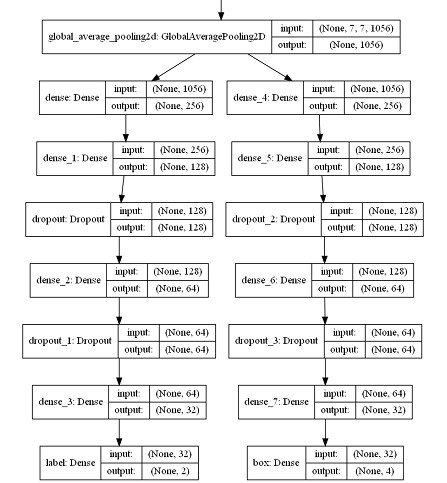
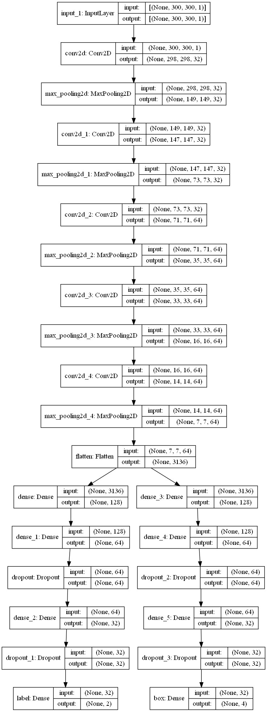

# Cats-vs-Dogs-Classification-and-Localiztion
Classification + localization on the image cat's or dog's face using convolutional neural networks.

# CNN
## Transfer learning
For transfer learning, it was used the NASNetMobile neural network trained on the ImageNet dataset. Only the last fully connected layer was retrained, which is responsible for image classification and bounding box definition. The resulting optimal fully connected layer architecture for the proposed dataset is shown on the picture below.



## Simple CNN
After studying the architectures of various CNN and conducting various experiments (with the dimension of the input window, optimizers, network depth, etc.), a small convolutional neural network was formed with the following architecture.



# Dataset
It was used The Oxford-IIIT Pet Dataset.

https://www.robots.ox.ac.uk/~vgg/data/pets/

# How to use?
### 1. Train chosen CNN
```
python train.py --dataset_dir D:\dataset
```

or (with all available parameters)
```
python train.py --dataset_dir D:\dataset --model 1 --valid_size 0.1 --image_size 224 --channels 3 --batch_size 32 --epochs 50 --model_savename NASnetMobile_0 --lr 1e-3 
--es_mindelta 1e-4 --es_patience 40 --rlr_factor 0.25 --rlr_patience 15
```

### 2. Check the trained model on the validation dataset
```
python evaluate.py --valid_dir D:\dataset --model_filename simpleCNN_0.h5
```
or (with all available parameters)
 ```
python evaluate.py --valid_dir D:\dataset --model_filename simpleCNN_0.h5 --batch_size 32 --image_size 300 --channels 1
```

### 3. Check the trained model on the chosen test images
The input can be an image or a folder with images, the output - a drawn image with a class and a bounding box.
```
python demo.py --testdata_path D:\test --model_filename simpleCNN_0.h5
```
or
```
python demo.py --testdata_path D:\test\dog.jpg --model_filename simpleCNN_0.h5
```
or (with all available parameters)
 ```
python demo.py --testdata_path D:\test\dog.jpg --model_filename simpleCNN_0.h5 –image_size 300 --channels 1
```

### 4. Dataset augmentation
```
python aug.py -- dataset_dir D:\dataset --aug_dir D:\aug_dataset
```
or (with all available parameters)
 ```
python aug.py -- dataset_dir D:\dataset --aug_dir D:\aug_dataset --mult 8
```

**For more information on the input parameters of scripts, see the --help option.**

Example:
```
python filename.py --help
```
